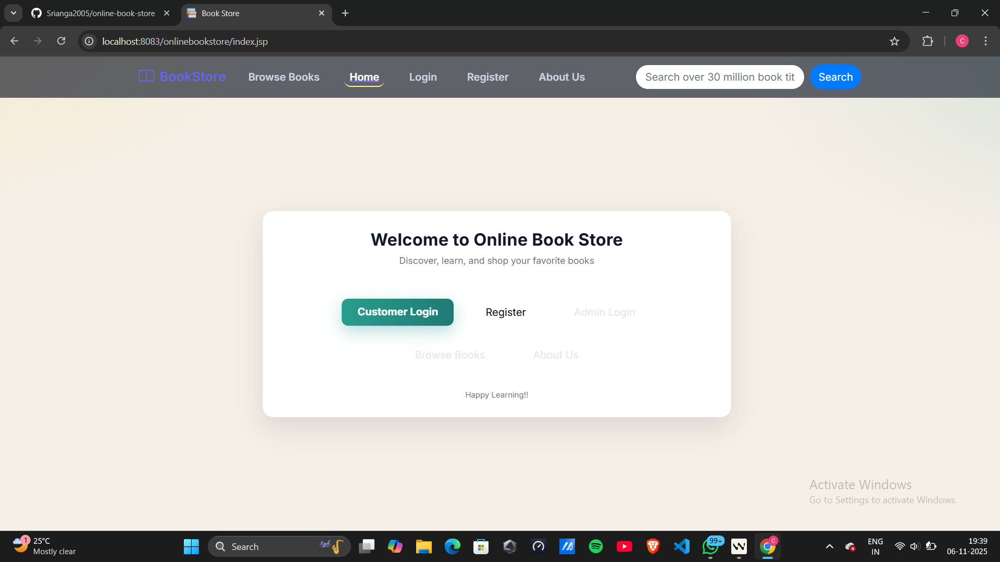
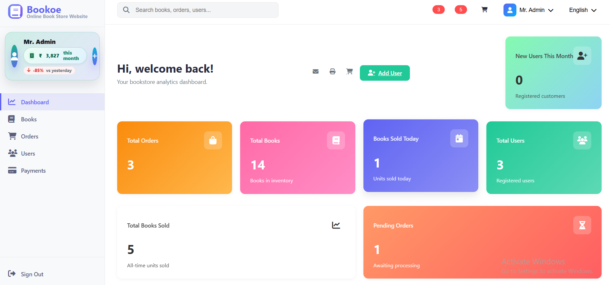
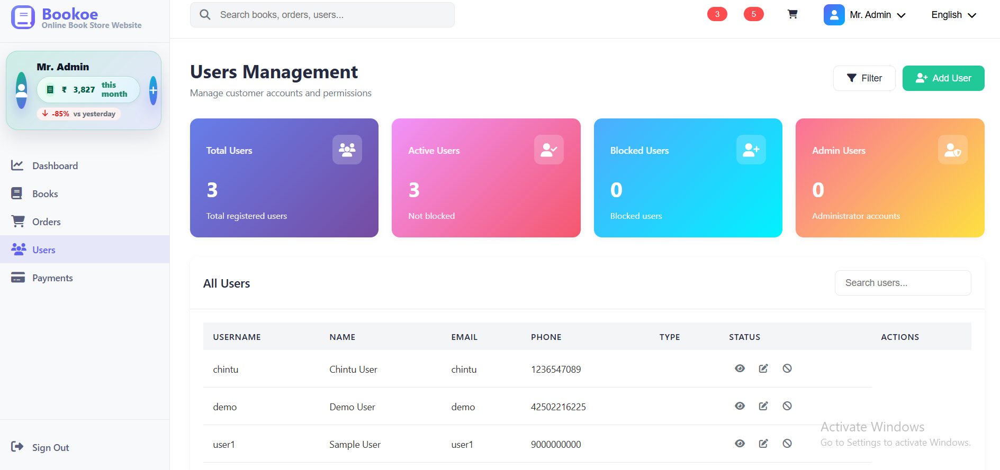
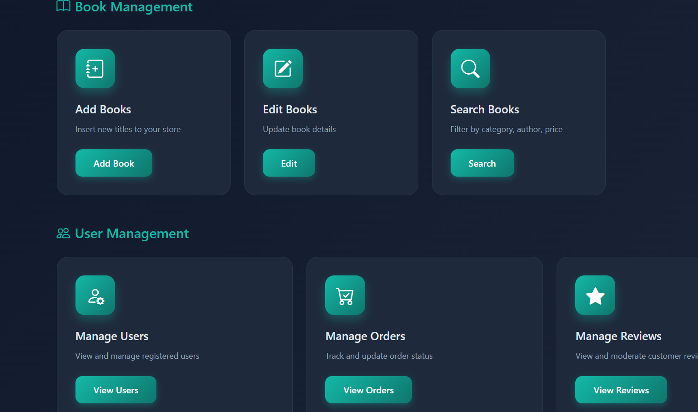
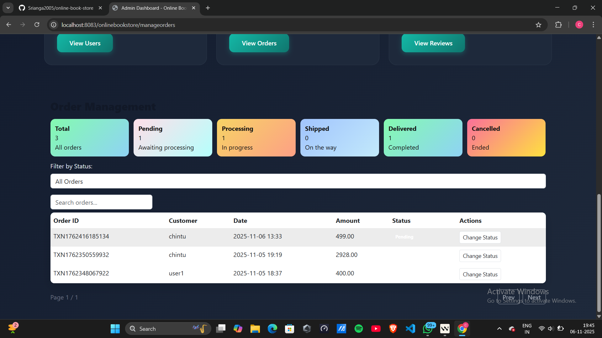
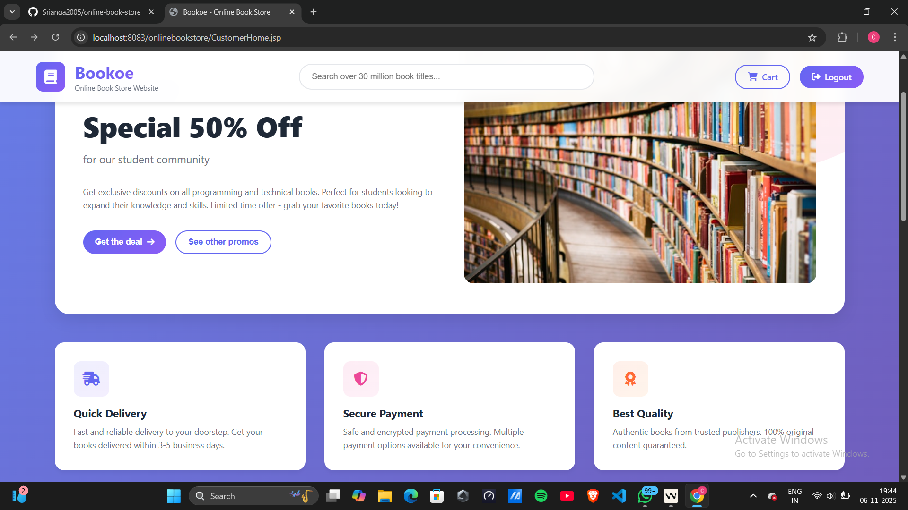
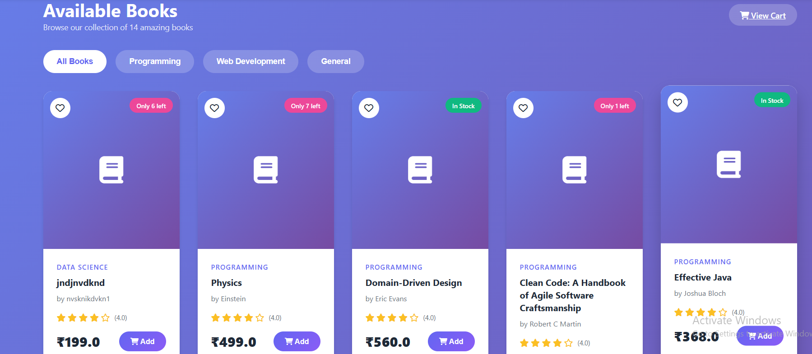
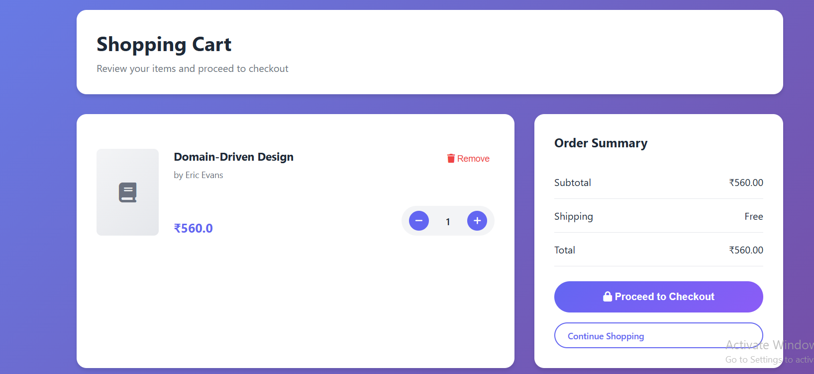
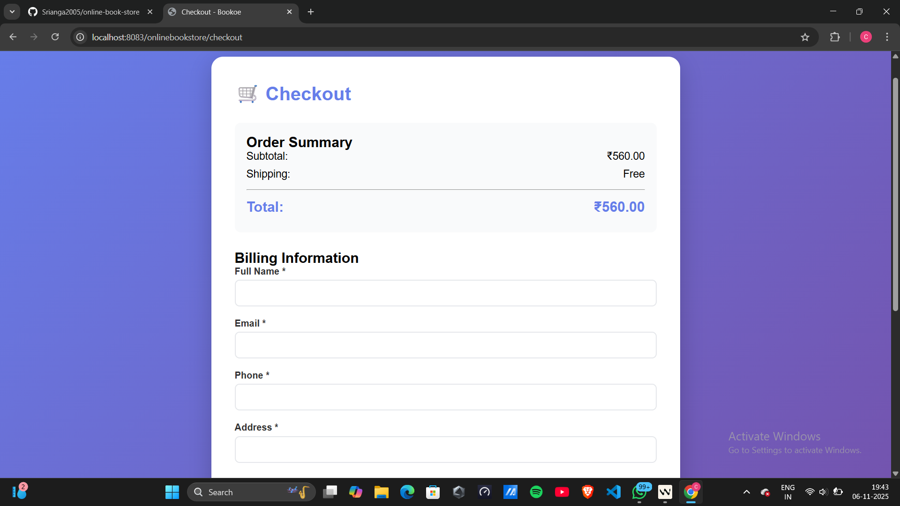
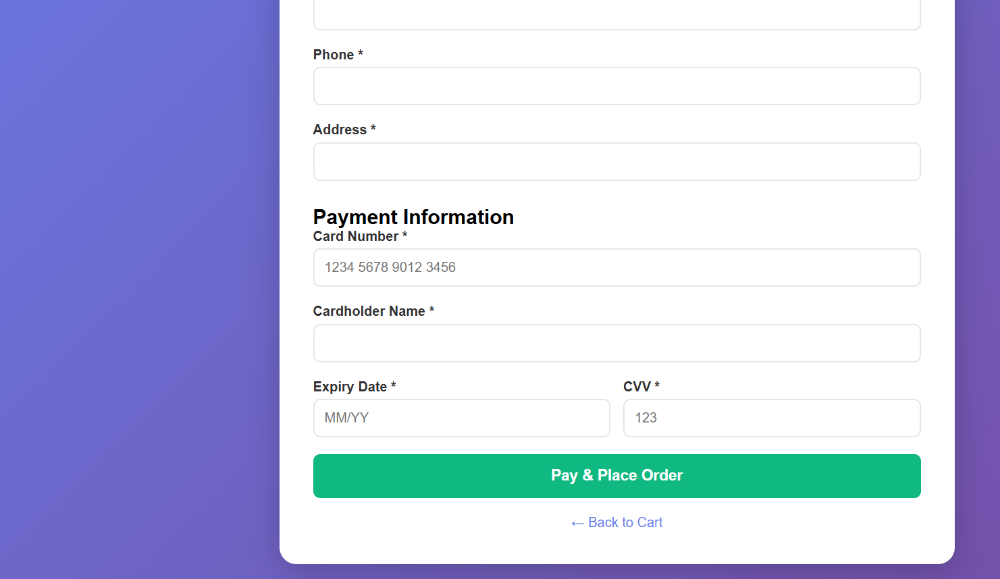

# Online Bookstore

     

Production-ready Java web application for managing an online bookstore with customer checkout and an admin dashboard (books, users, orders, payments).

This README describes the current project only. All old links, screenshots, and third‑party references were removed.

## Features
- Admin dashboard with stats (orders, revenue, trends)
- Manage books (add, update, inventory)
- Manage users and orders with search/pagination
- Payments view with filters (All / This month / Today)
- Checkout flow for customers (Pay & Place Order)
- UTF‑8 throughout; robust error handling

## Tech Stack
- Java 17, Maven (WAR)
- JSP, Servlets, JDBC
- MySQL (database: onlinebookstore)
- Embedded Tomcat via webapp‑runner
- Vanilla JS + simple CSS (no external frameworks required)

## Requirements
- Java 17
- Maven 3.8+
- MySQL Server

## Database Setup (MySQL)
1) Create database and tables (minimal):

```
CREATE DATABASE IF NOT EXISTS onlinebookstore;
USE onlinebookstore;

CREATE TABLE IF NOT EXISTS users (
  username VARCHAR(100) PRIMARY KEY,
  password VARCHAR(100),
  firstname VARCHAR(100),
  lastname VARCHAR(100),
  address TEXT,
  phone VARCHAR(100),
  mailid VARCHAR(100),
  usertype INT
);

CREATE TABLE IF NOT EXISTS books (
  barcode VARCHAR(100) PRIMARY KEY,
  name VARCHAR(100),
  author VARCHAR(100),
  price INT,
  quantity INT
);

-- orders and order_items assumed present in this project
```

2) Update DB credentials in the code if needed (DBUtil) and ensure MySQL is running.

## Run (Local)
1) Build the WAR:

```
mvn clean package -DskipTests
```

2) Start the embedded server:

```
start-server.bat
```

3) Open the app:

```
http://localhost:8083/onlinebookstore/
```

Admin pages:
- /onlinebookstore/admin-dashboard
- /onlinebookstore/admin/manage-books.jsp
- /onlinebookstore/admin/users.jsp
- /onlinebookstore/manageorders
- /onlinebookstore/admin/payments.jsp

## Demo Logins
- Admin:
  - Username: admin
  - Password: admin123
- User:
  - Username: chintu
  - Password: chintu

## Admin

> Screens below illustrate the admin experience. Place your images in `docs/screenshots/` using the suggested names, or adjust the paths if you use different filenames.

1) Home / Landing



Description: Public landing page with navigation, quick access to customer login and discovery actions.

2) Admin Dashboard



Description: Overview of total orders, books, today’s sales, users, and pending orders. Left sidebar shows the monthly revenue pill with trend.

3) Users Management



Description: Searchable and paginated user list with quick stats (Total, Active, Blocked, Admin). Actions available per user row.

4) Book Management Cards



Description: Quick actions for Add Books, Edit Books, Search Books, Users, Orders, and Reviews.

5) Add Book Form


Description: Form to create a new book with name, author, price, quantity, category, description, and optional image URL.

6) Orders Management



Description: Orders table with quick status cards, filter by status, fast search, and client-side pagination. Supports status updates.

## Users

> Screens below illustrate the customer experience. Place images in `docs/screenshots/` with the suggested names or adjust paths.

1) Customer Home



Description: Welcome hero, search bar, quick cards for delivery, payment security, and quality assurance.

2) Browse Books



Description: Catalog with category chips, pricing, ratings, stock badges, and Add to Cart actions.

3) Shopping Cart



Description: Cart summary with quantity controls, remove action, and order summary panel.

4) Checkout



Description: Order summary at the top followed by billing information form.

5) Payment Section



Description: Card number, cardholder, expiry, and CVV fields with a prominent Pay & Place Order button.

## Troubleshooting
- If build fails to clean target on Windows, stop the running server window and rebuild.
- Ensure MySQL is running and credentials match the DB settings.
- Clear browser cache/hard refresh (Ctrl+F5) after redeploys.

## Notes
- Default credentials are configurable; avoid hardcoding sensitive data.
- Remove demo data on production.

## About Me
Hi, I'm Srianga Kinkar Nayak — a Java developer focused on building practical, clean web apps. I enjoy designing admin dashboards, polishing UI/UX, and wiring robust backend logic with JSP/Servlets and MySQL.

Focus areas for this project:
- Admin experience: metrics, payments filters, orders/users management
- Checkout flow and receipts
- Modern, responsive styling with lightweight JS

## Contact
- GitHub: https://github.com/Srianga2005
- Email: sriangnayak@gmail.com
- LinkedIn: https://www.linkedin.com/in/srianga-kinkar-nayak-20703a341

## Project Structure
```
onlinebookstore-master/
├─ WebContent/                 # JSPs, static assets
│  ├─ admin/                   # Admin JSPs (dashboard, users, payments, etc.)
│  └─ WEB-INF/                 # web.xml
├─ src/main/java/
│  ├─ com/bittercode/model/    # POJOs: Book, Order, OrderItem, User
│  ├─ com/bittercode/service/  # Service interfaces
│  ├─ com/bittercode/service/impl/  # JDBC implementations
│  └─ servlets/                # Controllers/Servlets
├─ docs/screenshots/           # README images
├─ pom.xml                     # Maven build
└─ start-server.bat            # Run via embedded Tomcat
```

## URL Map
- Home: `/onlinebookstore/`
- Browse Books: `/onlinebookstore/ViewBooks.jsp`
- Cart: `/onlinebookstore/Cart.jsp`
- Checkout: `/onlinebookstore/checkout`
- Admin Dashboard: `/onlinebookstore/admin-dashboard`
- Manage Books: `/onlinebookstore/admin/manage-books.jsp`
- Users: `/onlinebookstore/admin/users.jsp`
- Orders: `/onlinebookstore/manageorders`
- Payments: `/onlinebookstore/admin/payments.jsp`

## Database Tables (overview)
- `users(username, password, firstname, lastname, address, phone, mailid, usertype)`
- `books(barcode, name, author, price, quantity)`
- `orders(order_id, user_email, total_amount, status, shipping_address, order_date)`
- `order_items(order_item_id, order_id, book_barcode, quantity, price)`

## Scripts
- Build: `mvn clean package -DskipTests`
- Run: `start-server.bat` (serves at `http://localhost:8083/onlinebookstore/`)

## Roadmap
- Payments page: add export CSV and date range picker
- Orders page: bulk status update, advanced filters
- Inventory: low-stock alerts, CSV import
- Auth: password reset and roles hardening

## Contributing
PRs and suggestions are welcome. Please: 
- Keep code formatted and avoid adding external libs unless necessary.
- Include a short description and screenshots for UI changes.

## Credits / Acknowledgements
- Built by Srianga Kinkar Nayak.
- Thanks to open‑source communities around Java, JSP/Servlets, Maven, and MySQL.

## Changelog
- 2025-11-06: New Admin and Users screenshots, polished sidebar metric, payments page hardening, README overhaul.
- 2025-11-05: Admin dashboard metrics and styling updates; payments filters; users/orders table search/pagination.
- 2025-11-04: Initial project setup with embedded Tomcat runner and MySQL integration.

## License
MIT License. You are free to use, copy, modify, and distribute this project with proper attribution. Suitable for educational and portfolio use.
